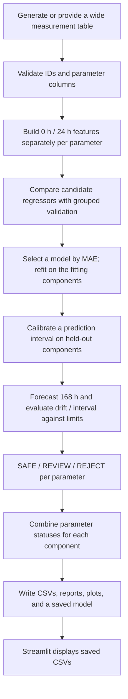

# SIH170 Module B: Project and Code Guide

This guide describes the code in this repository: what it takes in, how it forecasts the 168-hour measurement, how it assigns screening decisions, and what each source file and generated output is for.

## 1. What the program does

Module B is a per-parameter regression pipeline. For each active electrical parameter, it learns from that parameter's own 0-hour and 24-hour measurements and predicts its 168-hour measurement:

```text
Iddq 0 h + Iddq 24 h                 -> predicted Iddq 168 h
Leakage 0 h + Leakage 24 h           -> predicted Leakage 168 h
PropagationDelay 0 h + 24 h           -> predicted PropagationDelay 168 h
```

The prediction target is the **168-hour value**. The program derives predicted drift from that forecast and the 0-hour value, then uses the forecast interval and configured drift limit to label each parameter `SAFE`, `REVIEW`, or `REJECT`. The final component status combines the active parameter decisions.

The active parameter list currently contains **Iddq, Leakage, and PropagationDelay**. There are definitions for Icc, Vth, and RdsOn in the configuration catalog, but those are not active in the current run.

The generator creates measurements for 0 h, 24 h, 96 h, and 168 h. Although the 96-hour reading is present in generated rows, it is future information at the time the 168-hour forecast is made and is deliberately excluded from model features. Each parameter is predicted separately; other parameters are not inputs to its model. The synthetic generator can still give parameters shared lot/device influences.

## 2. The main flow



### Step 1: Generate data

`generate_synthetic_dataset()` makes one row per component. By default, `scripts/run_demo.py` requests 350 components, seven lots, seed 7, and the `balanced` profile. The generator includes component and lot variation, behavior classes, piecewise degradation, tester/process effects, and measurement noise. It writes `Data_Source=SYNTHETIC` and the chosen `Synthetic_Profile` on every row.

The three profiles are scenario settings, not estimates of real defect rates:

| Profile | Intended scenario |
| --- | --- |
| `easy_demo` | Mostly nominal components, with some defects and noise retained. |
| `balanced` | Historical/default generator mix. Used when no profile is supplied. |
| `stress` | More degradation, latent/abrupt cases, future variation, and noise. |

The generator is reproducible: the same seed, profile, and arguments produce the same table. Different seeds change the random sample. Reproducibility does not make the values real measurements; every generated row is synthetic.

### Step 2: Validate the input table

`validate_dataset()` checks that the table is nonempty and has `Component_ID`. It identifies which active parameters have their required 0-hour, 24-hour, and 168-hour columns, records missing/recommended identifiers such as `Lot_ID`, and reports missing or negative readings. Missing measurements and targets are not silently filled with fabricated values; rows without the required values are omitted from the relevant model fit.

The expected measurement column pattern is `{Parameter}_{hour}h`, for example `Iddq_0h`, `Iddq_24h`, `Iddq_96h`, and `Iddq_168h`. `Lot_ID`, `Device_Type`, and `Temperature` provide useful context; the latter two are not currently regression inputs.

### Step 3: Build features without looking ahead

For each parameter, the current feature matrix contains:

- its 0-hour and 24-hour measurements;
- the absolute change from 0 h to 24 h;
- the relative change over that interval;
- the 0-to-24-hour change per hour.

These are five columns derived from two readings. The model does not see that parameter's 96-hour or 168-hour measurement, other parameters' measurements, or full-dataset lot z-scores. The explicit guard in `build_feature_matrix()` rejects `include_96h=True` for prediction.

`Component_ID` is used to keep all records for a component together during validation. `Lot_ID` is used for leave-one-lot-out validation where available. At prediction/screening time, a separate 24-hour lot outlier check can downgrade a `SAFE` result to `REVIEW`; that z-score is not a regression feature.

### Step 4: Compare and fit models

The model zoo compares these regressors, when their dependencies are available:

- Linear Regression
- degree-2 Polynomial Regression with Ridge regularization
- RBF Support Vector Regression (`RBF_SVR`)
- Gaussian Process Regression (`GaussianProcess`)
- Random Forest
- Quantile Random Forest (`QuantileRandomForest`)
- XGBoost (optional import)

Two simple forecasts are included as reference candidates: carry the 24-hour value forward, or extend the 0-to-24-hour line to 168 hours. The selected model is the candidate with the lowest mean validation MAE in the original measurement units; RMSE breaks ties. A separate model is selected for each active parameter.

Validation groups by component so readings for one component cannot appear in both sides of a fold. When lot IDs are available, leave-one-lot-out results are used to select the model; otherwise component-grouped cross-validation is used. This tests generalization across held-out components/lots better than a random row split, though a small synthetic sample still gives an uncertain estimate.

### Step 5: Calibrate forecast uncertainty

The pipeline reserves a component-grouped split for interval calibration when there are enough components. The selected point model is fitted and selected without those calibration components. Their actual 168-hour values are then compared with the forecasts to calibrate prediction intervals. For most models, the interval is based on held-out residuals; for Quantile Random Forest, its quantile interval is conformalized. The configured `CONFORMAL_ALPHA=0.15` requests a nominal 85% interval.

“Nominal 85%” is a statistical target, not a promise that exactly 85% of future real chips will be covered. Calibration quality depends on representative data and enough independent components. With too few components, the code falls back to out-of-fold residual calibration, which is more exploratory.

### Step 6: Assign parameter and component statuses

For each parameter, the program compares the interval around its predicted 168-hour value with the configured relative-drift threshold. In the current configuration, Iddq and Leakage use 50% relative drift limits; PropagationDelay uses 25%. The review band is 5% of each limit. No active parameter currently has an absolute safety limit configured.

- **SAFE:** even the more concerning end of the prediction interval stays below the threshold with the configured margin.
- **REJECT:** even the more favorable end of the interval is beyond the threshold with the configured margin.
- **REVIEW:** the interval is near or crosses the decision boundary, so the automatic result is uncertain.

A strong 24-hour outlier within its lot can change `SAFE` to `REVIEW`. For the whole component, any `REJECT` makes the component `REJECT`; otherwise any `REVIEW` makes it `REVIEW`; only all-`SAFE` active parameters produce `SAFE` (also called `PASS` in the report).

These labels are the program's screening decisions under the current configured thresholds. `REVIEW` means a person would need to inspect the component or supporting evidence. It is not itself a measured failure. The thresholds are provisional demo values, not qualified limits from an SIH datasheet or reliability study.

### Step 7: Explain, perturb, and report

The explanation module tries model-appropriate explanations: SHAP contributions for supported tree models, coefficients for linear models, or model-agnostic sensitivity for other regressors. The robustness module perturbs the 0-hour input slightly and measures how much the forecast changes. These help inspect model behavior; they do not establish physical correctness.

The demo writes component forecasts, model/lot validation tables, robustness tables, screening lists, plots, and a serialized model. The Streamlit app reads those saved CSVs and shows them; it does **not** retrain a model or create fresh forecasts.

## 3. Files and their roles

| File or folder | Purpose |
| --- | --- |
| `README.md` | Short setup, run instructions, package overview, and caveats. |
| `PROJECT_GUIDE.md` | This detailed walkthrough. |
| `pyproject.toml` | Python package metadata and dependencies. The Streamlit dependency is in the optional `app` group. |
| `.gitignore` | Excludes environments, caches, and other local build/runtime files. |
| `app.py` | Read-only Streamlit dashboard for generated CSV files. |
| `scripts/run_demo.py` | Main end-to-end demo: generates data, trains, writes reports/plots, and saves/reloads the model. |
| `scripts/diagnose_regression_safety.py` | Separate research/diagnostic run comparing target formulations, candidate regressors, error patterns, threshold sensitivity, and lot generalization. It does not run as part of the main demo. |
| `tests/test_smoke.py` | Lightweight executable smoke checks for profile behavior/reproducibility, schema, target leakage guards, safety/conformal basics, and train/predict flow. |
| `src/ess_predictor/config.py` | Active parameter list, units, thresholds, generator settings/profile presets, fold count, random state, and interval alpha. |
| `src/ess_predictor/pipeline.py` | Orchestrates validation, model comparison/selection, fit, interval calibration, inference, and model save/load. Defines the trained-system and per-parameter bundles. |
| `src/ess_predictor/data/synthetic_data.py` | Reproducible synthetic component/lot measurement generator. |
| `src/ess_predictor/data/validation.py` | Input schema checks, data-quality warnings, and conservative missing-value handling. |
| `src/ess_predictor/features/engineering.py` | Creates the parameter-specific early-readout feature matrix and blocks 96-hour inputs to the forecast. |
| `src/ess_predictor/models/zoo.py` | Regressor and baseline definitions, plus Quantile Random Forest quantile prediction. |
| `src/ess_predictor/models/cross_validation.py` | Component-grouped and lot-grouped validation, out-of-fold predictions, metrics, and model selection. |
| `src/ess_predictor/uncertainty/conformal.py` | Fits and applies residual-based and conformalized-quantile prediction intervals. |
| `src/ess_predictor/safety/decision.py` | Per-parameter SAFE/REVIEW/REJECT rules, component-level aggregation, safety confusion metrics, and plausibility checks. |
| `src/ess_predictor/explainability/explain.py` | Local prediction contributions and global feature-importance helpers. |
| `src/ess_predictor/robustness/noise_testing.py` | Tests sensitivity to small input perturbations. |
| `src/ess_predictor/reporting/report.py` | Text formatting helpers for parameter/component reports. |
| `src/ess_predictor/visualization/plots.py` | Saves regression, residual, trajectory, interval, model-comparison, feature-importance, and decision plots. |
| `src/ess_predictor/**/__init__.py` | Package markers and brief subpackage descriptions. |
| `outputs/` | Generated CSVs and text reports. Regenerated by the scripts; not source code. |
| `plots/` | Generated PNG charts from the demo. |
| `models_store/` | Saved fitted system, normally `trained_system.pkl`. |

## 4. Main demo outputs

Running `python scripts/run_demo.py` writes or refreshes the following under `outputs/`:

| Output | What it contains |
| --- | --- |
| `synthetic_dataset.csv` | One row per generated component with IDs, context, synthetic labels, profile, and the active parameters' timepoint values. |
| `forecast_predictions.csv` | Actual and predicted 168-hour values, model, prediction basis, early readings, simple baselines, and errors. It includes LOLO/model-selection rows and a held-out component calibration split. |
| `leave_one_lot_out_mae.csv` | Per-parameter, per-model results for each held-out lot. These results are used to select a model when lot validation is available; they are not an independent final benchmark. |
| `robustness_{parameter}.csv` | Per-component response to small 0-hour input perturbations. |
| `screening_summary.txt` | Overall SAFE/PASS, REVIEW, and REJECT counts. |
| `component_disposition_report.txt` | Human-readable lists of safe, reviewed, and rejected components, with reported issues/reasons. |
| `component_dispositions.csv` | Machine-readable component/parameter disposition details and reasons. |
| `example_component_reports.txt` | A note pointing to the complete disposition list, retained for compatibility with the earlier sample-report filename. |

The demo saves the fitted bundles in `models_store/trained_system.pkl`. PNG charts for each active parameter are placed in `plots/`.

`forecast_predictions.csv` contains different prediction sets. The **held-out component split** is the clearest view of point forecasts for components excluded from point-model fitting and model selection; those components are used to calibrate prediction intervals. The **LOLO CV** rows are useful for model comparison, but the same lot-held-out scores are used in model selection, so they should not be presented as an independent test result.

The disposition report is produced by scoring all rows in the generated demo table with the fitted system. Some of those rows were used to fit the model, so the aggregate disposition counts are a demonstration of the workflow, not an unbiased measure of future screening accuracy. Use the held-out predictions and a separate untouched dataset for evaluation.

The separate diagnostic command writes a directory of its own, by default `outputs/regression_safety_diagnostics/`, containing:

- `regression_comparison.csv`
- `target_safety_metrics.csv`
- `behavior_error_analysis.csv`
- `residual_summary.csv`
- `selected_oof_predictions.csv`
- `threshold_sensitivity.csv`
- `lot_generalization.csv`

These are exploratory comparisons on synthetic data. The diagnostic threshold-sensitivity table reports what would happen at scaled thresholds; it does not change the configured decision limits.

## 5. Streamlit dashboard

The app reads the CSVs above and has views for:

1. **Overview:** selected parameter, model, prediction set, error metrics, reference-baseline errors, and screening counts.
2. **Actual vs predicted:** point forecasts versus actual 168-hour targets, error distribution, and largest errors.
3. **Component explorer:** one component's early readings, prediction, actual target, baseline forecasts, and measurement trajectory.
4. **Lot validation:** per-lot model scores and a reminder that LOLO scores informed model selection.
5. **Dispositions:** component statuses and parameter-specific reasons.
6. **CSV browser:** inspect and download the saved tables.

The app does not call `predict_component()` and does not retrain from the selected CSV. Run the demo again to refresh the data it displays.

## 6. Run commands (PowerShell)

From the project root, the existing virtual environment can run the scripts like this:

```powershell
.\.venv\Scripts\python.exe scripts/run_demo.py
.\.venv\Scripts\python.exe tests/test_smoke.py
.\.venv\Scripts\python.exe -m streamlit run app.py
```

To run the separate diagnostic with its defaults:

```powershell
.\.venv\Scripts\python.exe scripts/diagnose_regression_safety.py
```

The package can also be installed in the current environment, including the dashboard extra, with:

```powershell
.\.venv\Scripts\python.exe -m pip install -e ".[app]"
```

The demo and smoke script add the local `src/` folder to the import path themselves. The app needs Streamlit installed. The Quantile Random Forest dependency is declared in `pyproject.toml` and is imported by the model module.

## 7. Important limits when interpreting results

- The current default data is synthetic, including the apparent ground-truth 168-hour values. It does not show performance on real SIH170 devices.
- The generator encodes chosen behaviors, correlations, noise, and defect rates. Good model performance on it can partly reflect those design choices.
- `SAFE`, `REVIEW`, and `REJECT` follow placeholder drift limits. They are not certified pass/fail decisions until engineers replace and validate the limits against the official test specification and real data.
- `REVIEW` is an uncertainty/escalation route. It should not be counted as a definite rejection, though the main flagged/not-flagged confusion metrics count both REVIEW and REJECT as flagged.
- The most useful next evaluation is a real labeled dataset, with the split chosen to reflect intended deployment (for example, a wholly held-out production lot), and error reported in each parameter's engineering units.
- Check the `Prediction_Basis` column before quoting metrics. LOLO scores are used in model selection; the component split is held out from point-model fitting/selection but is used to calibrate forecast intervals.

## 8. Quick glossary

| Term | Meaning here |
| --- | --- |
| **MAE** | Average absolute difference between a forecast and the actual 168-hour value, in the parameter's engineering units. Lower is better. |
| **RMSE** | Square-root mean squared forecast error. It penalizes large misses more heavily than MAE. |
| **LOLO** | Leave-one-lot-out validation: train on some lots and score on another lot. |
| **OOF prediction** | Out-of-fold prediction made for a sample by a model that did not train on that sample's group/fold. |
| **Conformal interval** | A lower-to-upper forecast range calibrated from held-out errors or quantile residuals. |
| **Drift** | Change from the component's 0-hour measurement to its forecast 168-hour value; relative drift divides by the magnitude of the 0-hour value. |
| **False positive** | A component considered flagged (REVIEW or REJECT) even though its actual 168-hour value does not cross the configured synthetic truth threshold. |
| **False negative** | A truly over-threshold component labeled SAFE under the metric's definition. |
